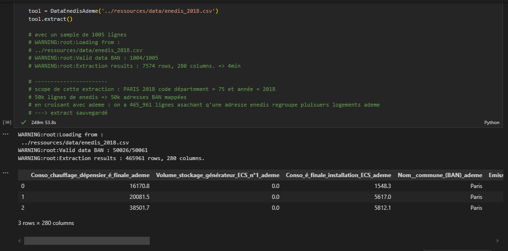

### Opendata University Challenge DPE

Last update : 23/12/2024

#### Données
- fait : classe pour extraire les données croisées consommations ENEDIS - API BAN - DPE ADEME  
- résultats des extracts par exploitation des API : [ici](ressources/data/)

#### Documentation du projet 

- Source : [Opendata university challenge DPE (defis data gouv)](https://defis.data.gouv.fr/defis/diagnostics-de-performance-energetique).
- TBD : problématique, objectifs, livrables etc..

#### How to ? 

For the project you can make a virtual env if needed. 

- After cloning, in your favorite terminal/shell do :
```
pip install -r requirements.txt
```
To fetch data :
 - see [this exemple notebook](notebooks/database.ipynb).
 - data extraction perf exemple w/o ascyncio : 
 